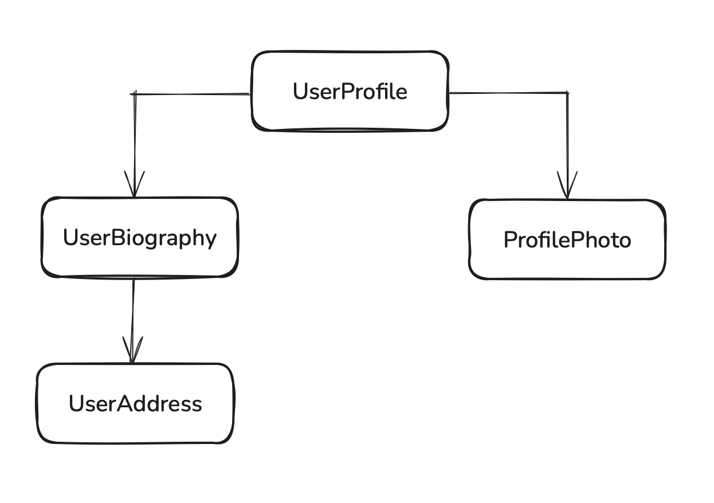

# Angular

Angular is a web framework that empowers developers to build fast, reliable applications. Angular provides a broad suite of tools, APIs, and libraries to simplify and streamline your development workflow.

## Installation

**Prerequisites**

- Node.js - v.18 or newer

**Install Angular CLI**

```shell
npm install -g @angular/cli
```

**Create a new project**

```shell
ng new <project-name>
```

**Running the project locally**

```shell
cd angular-app
npm start
```

## Essentials

### Components

Components are the main building blocks of Angular applications. Each component represents a part of a larger web page. Organizing an application into components helps provide structure to your project, clearly separating code into specific parts that are easy to maintain and grow over time.

**Defining a component**

Every component has the following core properties:

- A `@Component` decorator that contains some configuration used by Angular.
- An HTML template that controls what renders into the DOM.
- A CSS selector that defines how the component is used in HTML.
- A TypeScript class with behaviors, such as handling user input or making requests to a server.

```typescript
@Component({
  selector: "user-profile",
  template: `
    <h1>User profile</h1>
    <p>This is the user profile page</p>
  `,
})
export class UserProfile {}
```

The `@Component` decorator also optionally accepts a styles property for any CSS you want to apply to your template:

```typescript
// user-profile.ts
@Component({
  selector: "user-profile",
  template: `
    <h1>User profile</h1>
    </p>This is the user profile page</p>
  `,
  styles: `
    h1 {
      font-size: 3em;
    }
  `,
})
export class UserProfile {
  /* Your component code goes here */
}
```

**Separating HTML and CSS into separate files**

You can define a component's HTML and CSS in separate files using `templateUrl` and `styleUrl`:

```typescript
// user-profile.ts
@Component({
  selector: "user-profile",
  templateUrl: "user-profile.html",
  styleUrl: "user-profile.css",
})
export class UserProfile {}
```

```html
<!-- user-profile.html -->
<h1>Use profile</h1>
<p>This is the user profile page</p>
```

```css
/* user-profile.css */
h1 {
  font-size: 3em;
}
```

**Using components**

You build an application by composing multiple components together. For example, if you are building a user profile page, you might break the page up into several components like this:



Here, the `UserProfile` component uses several other components to produce the final page.

To import and use a component, you need to:

1. In your component's TypeScript file, add an import statement for the component you want to use.
2. In your @Component decorator, add an entry to the imports array for the component you want to use.
3. In your component's template, add an element that matches the selector of the component you want to use.

Here's an example of a `UserProfile` component importing a `ProfilePhoto` component:

```typescript
// user-profile.ts
import { ProfilePhoto } from "profile-photo.ts";
@Component({
  selector: "user-profile",
  imports: [ProfilePhoto],
  template: `
    <h1>User profile</h1>
    <profile-photo />
    <p>This is the user profile page</p>
  `,
})
export class UserProfile {
  // Component behavior is defined in here
}
```

### Signals

In Angular, you use _signals_ to create and manage state. A signal is a lightweight wrapper around a value.

Use the `signal` function to create a signal for holding local state:

```typescript
import { signal } from "@angular/core";
// Create a signal with the `signal` function.
const firstName = signal("Morgan");
// Read a signal value by calling it— signals are functions.
console.log(firstName());
// Change the value of this signal by calling its `set` method with a new value.
firstName.set("Jaime");
// You can also use the `update` method to change the value
// based on the previous value.
firstName.update((name) => name.toUpperCase());
```

Angular tracks where signals are read and when they're updated. The framework uses this information to do additional work, such as updating the DOM with new state. This ability to respond to changing signal values over time is known as reactivity.

**Computed expressions**

A `computed` is a signal that produces its value based on other signals.

```typescript
import { signal, computed } from "@angular/core";
const firstName = signal("Morgan");
const firstNameCapitalized = computed(() => firstName().toUpperCase());
console.log(firstNameCapitalized()); // MORGAN
```

A `computed` signal is read-only; it does not have a `set` or an `update` method. Instead, the value of the `computed` signal automatically changes when any of the signals it reads change:

```typescript
import { signal, computed } from "@angular/core";
const firstName = signal("Morgan");
const firstNameCapitalized = computed(() => firstName().toUpperCase());
console.log(firstNameCapitalized()); // MORGAN
firstName.set("Jaime");
console.log(firstNameCapitalized()); // JAIME
```

**Using signals in components**

Use `signal` and `computed` inside your components to create and manage state:

```typescript
@Component({
  /* ... */
})
export class UserProfile {
  isTrial = signal(false);
  isTrialExpired = signal(false);
  showTrialDuration = computed(() => this.isTrial() && !this.isTrialExpired());

  activateTrial() {
    this.isTrial.set(true);
  }
}
```

### Dynamic interfaces with templates

In Angular, a binding creates a dynamic connection between a component's template and its data. This connection ensures that changes to the component's data automatically update the rendered template.

You can create a binding to show some dynamic text in a template by using double curly-braces:

```typescript
@Component({
  selector: "user-profile",
  template: `<h1>Profile for {{ userName() }}</h1>`,
})
export class TodoListItem {
  userName = signal("pro_programmer_123");
}
```

When Angular renders the component, you see:

```html
<h1>Profile for pro_programmer_123</h1>
```

Angular automatically keeps the binding up-to-date when the value of the signal changes. Building on the example above, if we update the value of the `userName` signal:

```typescript
this.userName.set("cool_coder_789");
```

The rendered page updates to reflect the new value:

```html
<h1>Profile for cool_coder_789</h1>
```

**Setting dynamic properties and attributes**

Angular supports binding dynamic values into DOM properties with square brackets:

```typescript
@Component({
  /*...*/
  // Set the `disabled` property of the button based on the value of `isValidUserId`.
  template: `<button [disabled]="isValidUserId()">Save changes</button>`,
})
export class UserProfile {
  isValidUserId = signal(false);
}
```

You can also bind to HTML attributes by prefixing the attribute name with `attr.`:

```html
<!-- Bind the `role` attribute on the `<ul>` element to value of `listRole`. -->
<ul [attr.role]="listRole()"></ul>
```

Angular automatically updates DOM properties and attribute when the bound value changes.

**Handling user interaction**

Angular lets you add event listeners to an element in your template with parentheses:

```typescript
@Component({
  /*...*/
  // Add an 'click' event handler that calls the `cancelSubscription` method.
  template: `<button (click)="cancelSubscription()">
    Cancel subscription
  </button>`,
})
export class UserProfile {
  /* ... */

  cancelSubscription() {
    /* Your event handling code goes here. */
  }
}
```

If you need to pass the `event` object to your listener, you can use Angular's built-in `$event` variable inside the function call:

```typescript
@Component({
  /*...*/
  // Add an 'click' event handler that calls the `cancelSubscription` method.
  template: `<button (click)="cancelSubscription($event)">
    Cancel subscription
  </button>`,
})
export class UserProfile {
  /* ... */

  cancelSubscription(event: Event) {
    /* Your event handling code goes here. */
  }
}
```

**Control flow with `@if` and `@for`**

You can conditionally hide and show parts of a template with Angular's `@if` block:

```html
<h1>User profile</h1>

@if (isAdmin()) {
<h2>Admin settings</h2>
<!-- ... -->
}
```

The `@if` block also supports an optional `@else` block:

```html
<h1>User profile</h1>

@if (isAdmin()) {
<h2>Admin settings</h2>
<!-- ... -->
} @else {
<h2>User settings</h2>
<!-- ... -->
}
```

You can repeat part of a template multiple times with Angular's `@for` block:

```typescript
<h1>User profile</h1>

<ul class="user-badge-list">
  @for (badge of badges(); track badge.id) {
    <li class="user-badge">{{badge.name}}</li>
  }
</ul>
```

Angular's uses the `track` keyword, shown in the example above, to associate data with the DOM elements created by `@for`.

### Modular design with Dependency Injection

When you need to share logic between components, Angular leverages the design pattern of dependency injection that allows you to create a “service” which allows you to inject code into components while managing it from a single source of truth.

**What are services?**

Services are reusable pieces of code that can be injected.

Similar to defining a component, services are comprised of the following:

- A **TypeScript decorator** that declares the class as an Angular service via `@Injectable` and allows you to define what part of the application can access the service via the `providedIn` property (which is typically `'root'`) to allow a service to be accessed anywhere within the application.
- A **TypeScript class** that defines the desired code that will be accessible when the service is injected.

Here is an example of a `Calculator` service.

```typescript
import { Injectable } from "@angular/core";
@Injectable({ providedIn: "root" })
export class Calculator {
  add(x: number, y: number) {
    return x + y;
  }
}
```

**How to use a service**

When you want to use a service in a component, you need to:

1. Import the service
2. Declare a class field where the service is injected. Assign the class field to the result of the call of the built-in function `inject` which creates the service

Here’s what it might look like in the `Receipt` component:

```typescript
import { Component, inject } from "@angular/core";
import { Calculator } from "./calculator";
@Component({
  selector: "app-receipt",
  template: `<h1>The total is {{ totalCost }}</h1>`,
})
export class Receipt {
  private calculator = inject(Calculator);
  totalCost = this.calculator.add(50, 25);
}
```

In this example, the `Calculator` is being used by calling the Angular function `inject` and passing in the service to it.
