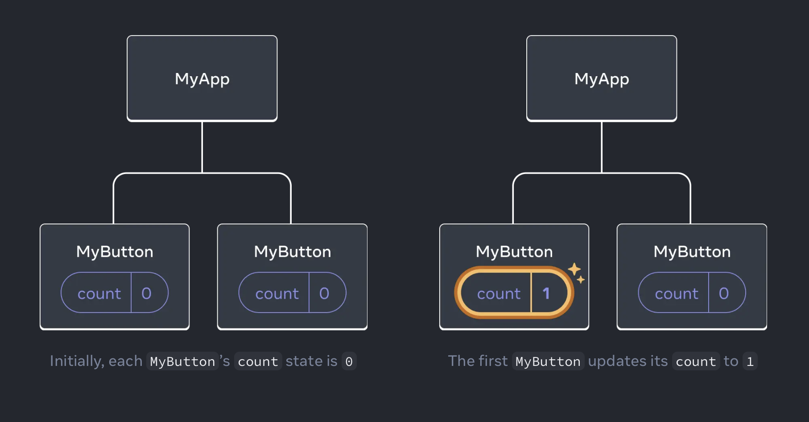
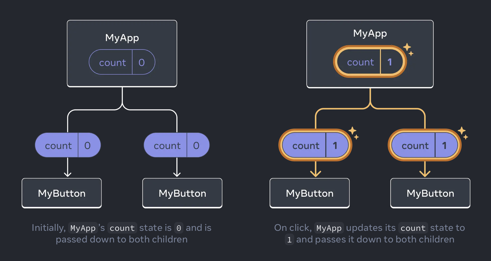

# react

## Basics

React lets you build user interfaces out of individual pieces called components. Create your own React components like `Thumbnail`, `LikeButton`, and `Video`. Then combine them into entire screens, pages, and apps.

```javascript
function Video({ video }) {
  return (
    <div>
      <Thumbnail video={video} />
      <a href={video.url}>
        <h3>{video.title}</h3>
        <p>{video.description}</p>
      </a>
      <LikeButton video={video} />
    </div>
  );
}
```

React components are JavaScript functions. Want to show some content conditionally? Use an `if` statement. Displaying a list? Try array `map()`. Learning React is learning programming.

```javascript
function VideoList({ videos, emptyHeading }) {
  const count = videos.length;
  let heading = emptyHeading;
  if (count > 0) {
    const noun = count > 1 ? "Videos" : "Video";
    heading = count + " " + noun;
  }
  return (
    <section>
      <h2>{heading}</h2>
      {videos.map((video) => (
        <Video key={video.id} video={video} />
      ))}
    </section>
  );
}
```

This markup syntax is called JSX. It is a JavaScript syntax extension popularized by React. Putting JSX markup close to related rendering logic makes React components easy to create, maintain, and delete.

React components receive data and return what should appear on the screen. You can pass them new data in response to an interaction, like when the user types into an input. React will then update the screen to match the new data.

```javascript
import { useState } from "react";

function SearchableVideoList({ videos }) {
  const [searchText, setSearchText] = useState("");
  const foundVideos = filterVideos(videos, searchText);
  return (
    <>
      <SearchInput
        value={searchText}
        onChange={(newText) => setSearchText(newText)}
      />
      <VideoList
        videos={foundVideos}
        emptyHeading={`No matches for “${searchText}”`}
      />
    </>
  );
}
```

## Quick Start

**Creating and nesting components**

React apps are made out of components. A component is a piece of the UI (user interface) that has its own logic and appearance. A component can be as small as a button, or as large as an entire page.

React components are JavaScript functions that return markup:

```javascript
function MyButton() {
  return <button>I'm a button</button>;
}
```

Now that you’ve declared `MyButton`, you can nest it into another component:

```javascript
export default function MyApp() {
  return (
    <div>
      <h1>Welcome to my app</h1>
      <MyButton />
    </div>
  );
}
```

_React component names must always start with a capital letter, while HTML tags must be lowercase._

**Adding styles**

In React, you specify a CSS class with `className`. It works the same way as the HTML `class` attribute:

```javascript

```

Then you write the CSS rules for it in a separate CSS file:

```css
.avatar {
  border-radius: 50%;
}
```

**Displaying data**

JSX lets you put markup into JavaScript. Curly braces let you “escape back” into JavaScript so that you can embed some variable from your code and display it to the user.

```javascript
return <h1>{user.name}</h1>;
```

```javascript
const user = {
  name: "Hedy Lamarr",
  imageUrl: "https://i.imgur.com/yXOvdOSs.jpg",
  imageSize: 90,
};

export default function Profile() {
  return (
    <>
      <h1>{user.name}</h1>
      
    </>
  );
}
```

**Conditional rendering**

In React, there is no special syntax for writing conditions. Instead, you’ll use the same techniques as you use when writing regular JavaScript code.

```javascript
let content;
if (isLoggedIn) {
  content = <AdminPanel />;
} else {
  content = <LoginForm />;
}
return <div>{content}</div>;
```

or

```javascript
<div>{isLoggedIn ? <AdminPanel /> : <LoginForm />}</div>
```

**Rendering lists**

For example, let’s say you have an array of products:

```javascript
const products = [
  { title: "Cabbage", id: 1 },
  { title: "Garlic", id: 2 },
  { title: "Apple", id: 3 },
];
```

Inside your component, use the `map()` function to transform an array of products into an array of `<li>` items:

```javascript
const listItems = products.map((product) => (
  <li key={product.id}>{product.title}</li>
));

return <ul>{listItems}</ul>;
```

Notice how `<li>` has a key attribute. For each item in a list, you should pass a string or a number that uniquely identifies that item among its siblings. Usually, a key should be coming from your data, such as a database ID. React uses your keys to know what happened if you later insert, delete, or reorder the items.

```javascript
const products = [
  { title: "Cabbage", isFruit: false, id: 1 },
  { title: "Garlic", isFruit: false, id: 2 },
  { title: "Apple", isFruit: true, id: 3 },
];

export default function ShoppingList() {
  const listItems = products.map((product) => (
    <li
      key={product.id}
      style={{
        color: product.isFruit ? "magenta" : "darkgreen",
      }}
    >
      {product.title}
    </li>
  ));

  return <ul>{listItems}</ul>;
}
```

**Responding to events**

You can respond to events by declaring event handler functions inside your components:

```javascript
function MyButton() {
  function handleClick() {
    alert("You clicked me!");
  }

  return <button onClick={handleClick}>Click me</button>;
}
```

Notice how `onClick={handleClick}` has no parentheses at the end! Do not call the event handler function: you only need to pass it down. React will call your event handler when the user clicks the button.

**Updating the screen**

Often, you’ll want your component to “remember” some information and display it. For example, maybe you want to count the number of times a button is clicked. To do this, add state to your component.

First, import `useState` from React:

```javascript
import { useState } from "react";
```

Now you can declare a state variable inside your component:

```javascript
function MyButton() {
  const [count, setCount] = useState(0);
  // ...
```

You’ll get two things from useState: the current state (`count`), and the function that lets you update it (`setCount`). You can give them any names, but the convention is to write `[something, setSomething]`.

```javascript
function MyButton() {
  const [count, setCount] = useState(0);

  function handleClick() {
    setCount(count + 1);
  }

  return <button onClick={handleClick}>Clicked {count} times</button>;
}
```

If you render the same component multiple times, each will get its own state. Click each button separately:

```javascript
import { useState } from "react";

export default function MyApp() {
  return (
    <div>
      <h1>Counters that update separately</h1>
      <MyButton />
      <MyButton />
    </div>
  );
}

function MyButton() {
  const [count, setCount] = useState(0);

  function handleClick() {
    setCount(count + 1);
  }

  return <button onClick={handleClick}>Clicked {count} times</button>;
}
```

**Using Hooks**

Functions starting with use are called Hooks. `useState` is a built-in Hook provided by React.

Hooks are more restrictive than other functions. You can only call Hooks at the top of your components (or other Hooks). If you want to use useState in a condition or a loop, extract a new component and put it there.

**Sharing data between components**

In the previous example, each `MyButton` had its own independent count, and when each button was clicked, only the count for the button clicked changed:



However, often you’ll need components to share data and always update together.

To make both `MyButton` components display the same `count` and update together, you need to move the state from the individual buttons “upwards” to the closest component containing all of them.

In this example, it is `MyApp`:



Now when you click either button, the `count` in `MyApp` will change, which will change both of the counts in `MyButton`. Here’s how you can express this in code.

First, move the state up from `MyButton` into `MyApp`:

```javascript
export default function MyApp() {
  const [count, setCount] = useState(0);

  function handleClick() {
    setCount(count + 1);
  }

  return (
    <div>
      <h1>Counters that update separately</h1>
      <MyButton />
      <MyButton />
    </div>
  );
}

function MyButton() {
  // ... we're moving code from here ...
}
```

Then, pass the state down from `MyApp` to each `MyButton`, together with the shared click handler. You can pass information to `MyButton` using the JSX curly braces, just like you previously did with built-in tags like ``:

```javascript
export default function MyApp() {
  const [count, setCount] = useState(0);

  function handleClick() {
    setCount(count + 1);
  }

  return (
    <div>
      <h1>Counters that update together</h1>
      <MyButton count={count} onClick={handleClick} />
      <MyButton count={count} onClick={handleClick} />
    </div>
  );
}
```

The information you pass down like this is called props. Now the `MyApp` component contains the `count` state and the `handleClick` event handler, and passes both of them down as props to each of the buttons.

Finally, change `MyButton` to read the props you have passed from its parent component:

```javascript
function MyButton({ count, onClick }) {
  return <button onClick={onClick}>Clicked {count} times</button>;
}
```

When you click the button, the `onClick` handler fires. Each button’s `onClick` prop was set to the `handleClick` function inside `MyApp`, so the code inside of it runs. That code calls `setCount(count + 1)`, incrementing the `count` state variable. The new `count` value is passed as a prop to each button, so they all show the new value. This is called “lifting state up”. By moving state up, you’ve shared it between components.

```javascript
import { useState } from "react";

export default function MyApp() {
  const [count, setCount] = useState(0);

  function handleClick() {
    setCount(count + 1);
  }

  return (
    <div>
      <h1>Counters that update together</h1>
      <MyButton count={count} onClick={handleClick} />
      <MyButton count={count} onClick={handleClick} />
    </div>
  );
}

function MyButton({ count, onClick }) {
  return <button onClick={onClick}>Clicked {count} times</button>;
}
```
